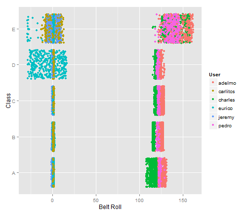
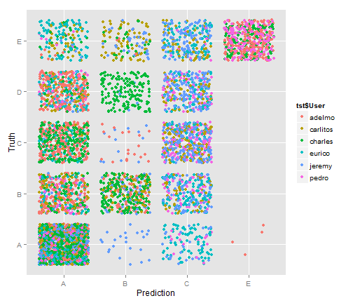
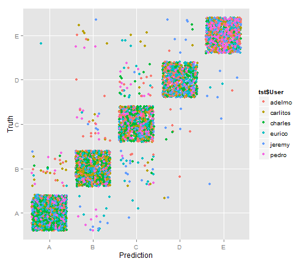

Practical Machine Learning Assignment Write-up
========================================================

**QUESTION:** Can we predict how well a user performed barbell lifts?

**DATASET:** Information from accelerometers for 6 participants, who were asked to perform barbell lifts:
* Exactly according to the specification (Class A)
* Throwing the elbows to the front (Class B)
* Lifting the dumbbell only halfway (Class C)
* Lowering the dumbbell only halfway (Class D) 
* Throwing the hips to the front (Class E)

More information about the dataset is available here:
http://groupware.les.inf.puc-rio.br/har#dataset#ixzz35JRAt5qV

The dataset includes an index variable, user name, timestamp, window, and the results from accelerometer measurements. Index, timestamp, and window are were excluded as non-relevant to prediction. Accelerometer measurements include roll, pitch, yaw, acceleration in three directions, gyros in three directions, magnet in three directions, and total acceleration. Summary metrics are also included for yaw, roll, pitch, and total acceleration but were excluded from model building due to a significant number of missing or non-numeric observations.


```r
# REQUIRED PACKAGES
library(caret)
library(ggplot2)
set.seed(999)

# READ & PROCESS DATA
data <- read.table("http://d396qusza40orc.cloudfront.net/predmachlearn/pml-training.csv",
                   header = TRUE, sep = ",", colClasses = "character")
data <- data[, c(2, 8:11, 37:49, 60:68, 84:86, 102, 113:124, 140, 151:160)]
names(data) <- c("User", names(data[, 2:54]))
for (i in 2:53) data[, i] <- as.numeric(data[, i])
data$classe <- as.factor(data$classe)
data$User <- as.factor(data$User)

# CREATE TRAINING AND TESTING SUBSETS
intrn <- createDataPartition(y = data$classe, p = 0.7, list = FALSE)
trn <- data[intrn, ]
tst <- data[-intrn, ]
rm(data, intrn, i)
```

User was maintained as a factor variable since individual users were significant drivers of variability in accelerometer measurements. For example, the plot below shows Class as a function of Belt Roll, classified by User.

 

**ALGORITHM:** As the objective is to classify barbell lifts into five different options, trees were slected as the perferred method. The caret package was used to build the models.

A simple prediction tree was constructed first. However, it was determined inadequate when it exhibited very poor performance and did not predict for all five classes.


```r
tree <- train(classe ~ ., method = "rpart", data = trn)
```


```
## CART 
## 
## 13737 samples
##    53 predictors
##     5 classes: 'A', 'B', 'C', 'D', 'E' 
## 
## No pre-processing
## Resampling: Bootstrapped (25 reps) 
## 
## Summary of sample sizes: 13737, 13737, 13737, 13737, 13737, 13737, ... 
## 
## Resampling results across tuning parameters:
## 
##   cp    Accuracy  Kappa  Accuracy SD  Kappa SD
##   0.04  0.5       0.4    0.02         0.03    
##   0.06  0.4       0.2    0.07         0.1     
##   0.1   0.3       0.06   0.04         0.06    
## 
## Accuracy was used to select the optimal model using  the largest value.
## The final value used for the model was cp = 0.04.
```

 

Next, boosting with trees was performed, resulting in significantly improved performance.


```r
boost.tree <- train(classe ~ ., method = "gbm", data = trn, verbose = FALSE)
```


```
## Stochastic Gradient Boosting 
## 
## 13737 samples
##    53 predictors
##     5 classes: 'A', 'B', 'C', 'D', 'E' 
## 
## No pre-processing
## Resampling: Bootstrapped (25 reps) 
## 
## Summary of sample sizes: 13737, 13737, 13737, 13737, 13737, 13737, ... 
## 
## Resampling results across tuning parameters:
## 
##   interaction.depth  n.trees  Accuracy  Kappa  Accuracy SD  Kappa SD
##   1                  50       0.8       0.7    0.006        0.008   
##   1                  100      0.8       0.8    0.006        0.008   
##   1                  200      0.9       0.8    0.004        0.005   
##   2                  50       0.9       0.8    0.004        0.006   
##   2                  100      0.9       0.9    0.003        0.003   
##   2                  200      0.9       0.9    0.002        0.003   
##   3                  50       0.9       0.9    0.005        0.006   
##   3                  100      0.9       0.9    0.003        0.004   
##   3                  200      1         0.9    0.002        0.003   
## 
## Tuning parameter 'shrinkage' was held constant at a value of 0.1
## Accuracy was used to select the optimal model using  the largest value.
## The final values used for the model were n.trees = 150,
##  interaction.depth = 3 and shrinkage = 0.1.
```

 

**EVALUATION:** Final model performance was assessed using the confusion matrix function of the caret package. This estimates an overall out-of-sample accuracy of more than 96% and negative predictive value for Class A (i.e., the probability that the algorithm will correctly predict that the dumbell was performed incorrectly) of more than 99%.


```
## Confusion Matrix and Statistics
## 
##           Reference
## Prediction    A    B    C    D    E
##          A 1650   33    0    0    1
##          B   19 1070   25    2   11
##          C    3   34  991   40    7
##          D    2    1    9  915   10
##          E    0    1    1    7 1053
## 
## Overall Statistics
##                                       
##                Accuracy : 0.965       
##                  95% CI : (0.96, 0.97)
##     No Information Rate : 0.284       
##     P-Value [Acc > NIR] : < 2e-16     
##                                       
##                   Kappa : 0.956       
##  Mcnemar's Test P-Value : 2.73e-06    
## 
## Statistics by Class:
## 
##                      Class: A Class: B Class: C Class: D Class: E
## Sensitivity             0.986    0.939    0.966    0.949    0.973
## Specificity             0.992    0.988    0.983    0.996    0.998
## Pos Pred Value          0.980    0.949    0.922    0.977    0.992
## Neg Pred Value          0.994    0.985    0.993    0.990    0.994
## Prevalence              0.284    0.194    0.174    0.164    0.184
## Detection Rate          0.280    0.182    0.168    0.155    0.179
## Detection Prevalence    0.286    0.192    0.183    0.159    0.180
## Balanced Accuracy       0.989    0.964    0.974    0.972    0.986
```
